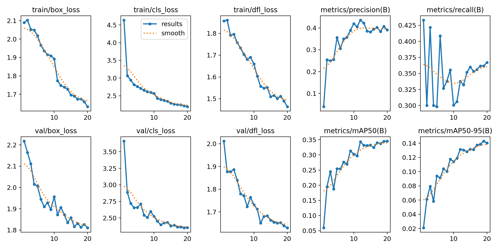
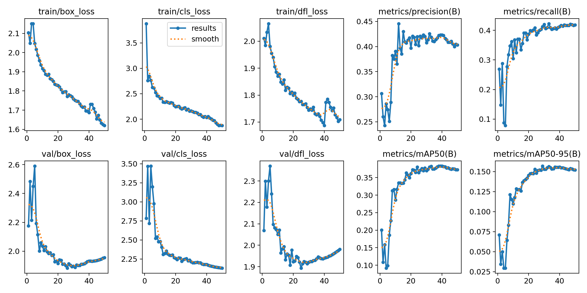

[README (3).md](https://github.com/user-attachments/files/25787778/README.3.md)
# 🫁 RSNA Pneumonia Detection — YOLOv8 Object Detection

A full end-to-end deep learning pipeline that detects pneumonia in chest X-rays using YOLOv8. Built on the [RSNA Pneumonia Detection Challenge](https://www.kaggle.com/c/rsna-pneumonia-detection-challenge) dataset — the model doesn't just classify whether pneumonia is present, it **localises exactly where** in the lung it appears by drawing bounding boxes around regions of opacity.

> Built and trained entirely on a Lenovo LOQ 2024 (Ryzen 7 7435HS, RTX 4060 8GB, 24GB RAM) — no cloud compute used.

---

## 📋 Table of Contents

- [What This Is](#what-this-is)
- [Dataset](#dataset)
- [Full Pipeline](#full-pipeline)
- [Environment Setup](#environment-setup)
- [Problems Encountered & How They Were Fixed](#problems-encountered--how-they-were-fixed)
- [Training Runs](#training-runs)
- [Results](#results)
- [How To Run](#how-to-run)
- [Project Structure](#project-structure)
- [What I Learned](#what-i-learned)

---

## What This Is

Most pneumonia detection projects treat this as a **binary classification** problem — does this image have pneumonia or not? This project goes further by treating it as an **object detection** problem.

Instead of predicting yes/no, the model:
- Scans the entire chest X-ray
- Draws bounding boxes around regions of lung opacity
- Assigns a confidence score to each detection

This is significantly harder than classification — the model must understand not just *that* pneumonia is present but *where* it is. A naive classifier that always predicts "no pneumonia" would score ~75% classification accuracy on this dataset due to class imbalance, while scoring 0% mAP50 since it never produces any boxes. mAP50 cannot be gamed by class imbalance, making it a far more honest metric for this task.

---

## Dataset

**Source:** [RSNA Pneumonia Detection Challenge — Kaggle](https://www.kaggle.com/c/rsna-pneumonia-detection-challenge)

| Property | Value |
|---|---|
| Total images | ~26,000 chest X-rays |
| Format | DICOM (.dcm) — raw medical scanner format |
| Labels | CSV with bounding box coordinates + Target column |
| Positive rate | ~22% (pneumonia present) |
| Train split | 21,349 images |
| Val split | 5,336 images |
| Positive label files | 4,810 train / 1,202 val |

The dataset has significant **class imbalance** — ~78% of images are healthy (Target=0), ~22% have pneumonia (Target=1). This reflects real-world clinical distribution. Healthy images have no label file — YOLO treats them as negative samples automatically.

---

## Full Pipeline

### Step 1 — DICOM → PNG Conversion

Medical imaging uses DICOM format — a complex file type that stores both image data and patient metadata. Standard ML frameworks can't read it directly. Each `.dcm` file was converted to `.png` using `pydicom`:

```python
import pydicom
import numpy as np
from PIL import Image
import os

def convert_dicom_to_png(dicom_path, output_path):
    dcm = pydicom.dcmread(dicom_path)
    pixel_array = dcm.pixel_array
    # Normalize pixel values to 0-255
    pixel_array = (pixel_array - pixel_array.min()) / (pixel_array.max() - pixel_array.min()) * 255
    img = Image.fromarray(pixel_array.astype(np.uint8))
    img.save(output_path)
```

### Step 2 — CSV → YOLO Label Conversion

The RSNA CSV provided bounding boxes in pixel coordinates:
```
patientId, x, y, width, height, Target
abc123, 300, 240, 150, 180, 1
```

YOLO requires normalized coordinates in this exact format:
```
class_index x_center y_center width height
```
Where all values are between 0 and 1. Conversion math:

```python
x_center = (x + width / 2) / image_width
y_center = (y + height / 2) / image_height
w = width / image_width
h = height / image_height
```

Only rows with `Target=1` were converted — healthy images (Target=0) get empty label treatment from YOLO automatically.

### Step 3 — Train/Val Split

Dataset split 80/20:
- `images/train` — 21,349 images
- `images/val` — 5,336 images
- `labels/train` — 4,810 label files
- `labels/val` — 1,202 label files

### Step 4 — Dataset Config

```yaml
# rsna.yaml
path: E:\Model\rsna-pneumonia-detection-challenge\rsna_yolo_dataset
train: images/Train
val: images/val

nc: 1
names:
  0: pneumonia
```

### Step 5 — Training

Two training runs were conducted — see [Training Runs](#training-runs) for full details.

---

## Environment Setup

```bash
# Create virtual environment with Python 3.11
python -m venv venv
venv\Scripts\activate.bat  # Windows CMD

# Install PyTorch with CUDA 12.1
pip install torch torchvision torchaudio --index-url https://download.pytorch.org/whl/cu121

# Install Ultralytics YOLOv8
pip install ultralytics pydicom pandas pillow

# Verify GPU is available
python -c "import torch; print(torch.cuda.is_available()); print(torch.cuda.get_device_name(0))"
```

Expected output:
```
True
NVIDIA GeForce RTX 4060 Laptop GPU
```

---

## Problems Encountered & How They Were Fixed

This section documents every real failure hit during this project. These weren't tutorial mistakes — they required systematic diagnosis to identify and fix.

---

### ❌ Problem 1 — Missing `nc` Field Caused Silent Zero Accuracy

**Symptom:** Model trained for a full hour on 21,349 images. Every metric — box_loss, dfl_loss, precision, recall, mAP50 — was exactly zero every epoch. Graphs completely flat. No error thrown.

**Root cause:** The `rsna.yaml` config was missing `nc: 1` (number of classes). Without it, YOLOv8 had no valid class definition and silently rejected every bounding box in every label file. The GPU ran real computation for an hour on images with zero valid labels attached.

**What made it hard to spot:** YOLO gave no error or warning. It trained normally and produced garbage metrics. The only symptom was everything being exactly zero.

**Fix:** Added `nc: 1` to rsna.yaml. One missing line caused the entire training run to be worthless.

**Before — broken training (all flat at zero):**


---

### ❌ Problem 2 — Folder Casing Mismatch

**Symptom:** After fixing `nc`, training showed `0 images found` and `WARNING: Labels are missing or empty`.

**Root cause:** Dataset folders were named `Images` and `Labels` (capital first letter). YOLO constructs the label path by replacing `images` → `labels` (lowercase) internally. Windows resolved the path due to case-insensitivity, but YOLO's cache scanner flagged all images as unlabelled because of the mismatch in its internal path logic.

**Fix:**
```cmd
ren Images images
ren Labels labels
```

---

### ❌ Problem 3 — Stale Cache Files

**Symptom:** After fixing folder names, scanner still read old broken data.

**Root cause:** YOLO caches dataset scans in `.cache` files for speed. The cached data was from broken runs — it remembered labels as missing and kept using that.

**Fix:** Deleted cache files before retraining:
```cmd
del images\Train.cache
del images\val.cache
```

---

### ❌ Problem 4 — Virtual Environment Lost With Machine

**Symptom:** `ModuleNotFoundError: No module named 'torch'`

**Root cause:** The original working environment with CUDA PyTorch was on a separate machine that stopped functioning. Running `yolo` picked up the system Python (3.13) which had no torch installed.

**Fix:** Rebuilt virtual environment from scratch on Python 3.11, reinstalled PyTorch CUDA and Ultralytics. Full rebuild took under 15 minutes.

---

### ❌ Problem 5 — Corrupt Stray File in Training Folder

**Symptom:** `WARNING: ignoring corrupt image: Images\Train\New Bitmap image.bmp`

**Root cause:** A stray empty bitmap file accidentally created in the training images folder.

**Fix:**
```cmd
del "Images\Train\New Bitmap image.bmp"
```

---

## Training Runs

Two training runs were conducted to evaluate the impact of model size and training duration on a challenging medical imaging dataset.

---

### Run 1 — YOLOv8n (Nano), 20 Epochs

The initial baseline run using the smallest YOLOv8 variant.

```bash
yolo detect train data=rsna.yaml model=yolov8n.pt epochs=20 imgsz=512 batch=8 device=0
```

| Parameter | Value |
|---|---|
| Model | yolov8n (3M parameters) |
| Epochs | 20 |
| Image size | 512px |
| Batch size | 8 |
| VRAM used | ~0.7GB (9% of 8GB) |
| Training time | 1.749 hours |

**Results:**

| Metric | Value |
|---|---|
| mAP50 | 0.344 (34.4%) |
| mAP50-95 | 0.143 (14.3%) |
| Precision | 0.407 (40.7%) |
| Recall | 0.362 (36.2%) |



**Observations:** All losses decrease consistently. Recall was noisy and unstable — the model hadn't fully converged. Only 9% of available VRAM was used, leaving significant headroom for a larger model.

---

### Run 2 — YOLOv8s (Small), 50 Epochs

Second run using a larger model variant with more training time, informed by observations from Run 1.

```bash
yolo detect train data=rsna.yaml model=yolov8s.pt epochs=50 imgsz=640 batch=16 device=0
```

| Parameter | Value |
|---|---|
| Model | yolov8s (11M parameters) |
| Epochs | 50 |
| Image size | 640px |
| Batch size | 16 |
| Training time | 5.627 hours |

**Results:**

| Metric | Value |
|---|---|
| mAP50 | 0.377 (37.7%) |
| mAP50-95 | 0.157 (15.7%) |
| Precision | 0.420 (42.0%) |
| Recall | 0.413 (41.3%) |



**Observations:** Recall improved significantly (+5.1%) and stabilised — the model became more consistent at finding pneumonia cases previously missed. mAP50 curves were still climbing at epoch 50, suggesting the model had not fully converged and would benefit from further training.

---

## Results — Side By Side

| Metric | Run 1 (n, 20ep) | Run 2 (s, 50ep) | Δ Change |
|---|---|---|---|
| mAP50 | 34.4% | 37.7% | +3.3% |
| mAP50-95 | 14.3% | 15.7% | +1.4% |
| Precision | 40.7% | 42.0% | +1.3% |
| Recall | 36.2% | 41.3% | +5.1% |
| Training time | 1.75 hrs | 5.63 hrs | +3.9 hrs |
| Model size | 6.2MB | 22.5MB | 4x larger |
| VRAM used | ~0.7GB | ~3GB | — |

The modest accuracy gains despite significantly more compute reflect the fundamental difficulty of this dataset — pneumonia opacity in X-rays is diffuse and subtle, ground truth labels have inherent noise from inter-radiologist disagreement, and top Kaggle competition entries with large ensembles reached only ~0.65 mAP50. The gains are real but the dataset is the ceiling, not the model.

---

## How To Run

### 1. Clone the repo
```bash
git clone https://github.com/yourusername/rsna-pneumonia-detection
cd rsna-pneumonia-detection
```

### 2. Download the dataset
Download from [Kaggle RSNA Pneumonia Detection Challenge](https://www.kaggle.com/c/rsna-pneumonia-detection-challenge) and place in the project directory.

### 3. Set up environment
```bash
python -m venv venv
venv\Scripts\activate.bat
pip install torch torchvision torchaudio --index-url https://download.pytorch.org/whl/cu121
pip install ultralytics pydicom pandas pillow
```

### 4. Run the pipeline
```bash
# Convert DICOM to PNG
python convert_dicom_to_png.py

# Generate YOLO labels from CSV
python csv_to_yolo_labels.py

# Split into train/val
python split_train_val.py

# Train
yolo detect train data=rsna.yaml model=yolov8s.pt epochs=50 imgsz=640 batch=16 device=0

# Run inference on a single image
yolo detect predict model=runs/train/weights/best.pt source=path/to/xray.png
```

---

## Project Structure

```
rsna-pneumonia-detection/
│
├── convert_dicom_to_png.py     # DICOM → PNG conversion
├── csv_to_yolo_labels.py       # CSV → YOLO label conversion
├── split_train_val.py          # 80/20 train/val split
├── rsna.yaml                   # Dataset config
├── requirements.txt
├── README.md
│
├── weights/
│   └── best.pt                 # Best trained model weights (yolov8s, Run 2)
│
└── results/
    ├── broken_results.png      # Pre-fix broken training curves (all zero)
    ├── results_n20.png         # Run 1 — yolov8n 20 epochs
    ├── results_s50.png         # Run 2 — yolov8s 50 epochs
    └── val_predictions.jpg     # Sample predictions on validation X-rays
```

---

## What I Learned

**On medical imaging:**
- DICOM is the standard medical imaging format — requires `pydicom` to extract pixel arrays, not readable by standard image libraries
- Chest X-rays are 2D projections of 3D structures — ribs, heart, and vessels overlap lung regions, making opacity detection inherently ambiguous
- Even trained radiologists disagree on bounding box placement — ground truth labels have noise baked in

**On ML pipelines:**
- YOLO silently ignores invalid labels with no error — zero box_loss every epoch is the only symptom of a completely broken label pipeline
- mAP50 is immune to class imbalance — a model that always predicts "no pneumonia" scores 75% classification accuracy but 0% mAP50
- Cache files from broken runs persist and cause misleading behaviour on subsequent runs
- Virtual environments are per-machine — losing a machine means a full environment rebuild

**On debugging:**
- Systematic isolation — identifying whether the problem was the yaml, labels, paths, or environment one at a time
- Reading training metrics as diagnostics — flat losses indicate no valid labels, not a model or hardware failure
- The GPU running for an hour doesn't mean training worked — it means computation happened, not that it was meaningful

**On hardware:**
- RTX 4060 (8GB VRAM) used only ~0.7GB (9%) on yolov8n — significant headroom exists for larger models
- yolov8s at imgsz=640, batch=16 consumed ~6GB VRAM — the jump comes from larger model weights (11M vs 3M parameters), larger feature maps from higher resolution, doubled batch size, and gradient storage during backpropagation all stacking together
- Windows reserves ~200-300MB VRAM at boot for display output even on dedicated GPUs — effective available VRAM is ~7.7GB, not the full 8GB
- CUDA setup requires matching Python version (3.11), correct PyTorch wheel (cu121), and an isolated virtual environment

---

## Tech Stack

- Python 3.11
- PyTorch 2.5.1 + CUDA 12.1
- Ultralytics YOLOv8
- pydicom
- pandas
- PIL / Pillow
- NVIDIA RTX 4060 Laptop GPU (8GB VRAM)

---

*Dataset: RSNA Pneumonia Detection Challenge — Radiological Society of North America*
